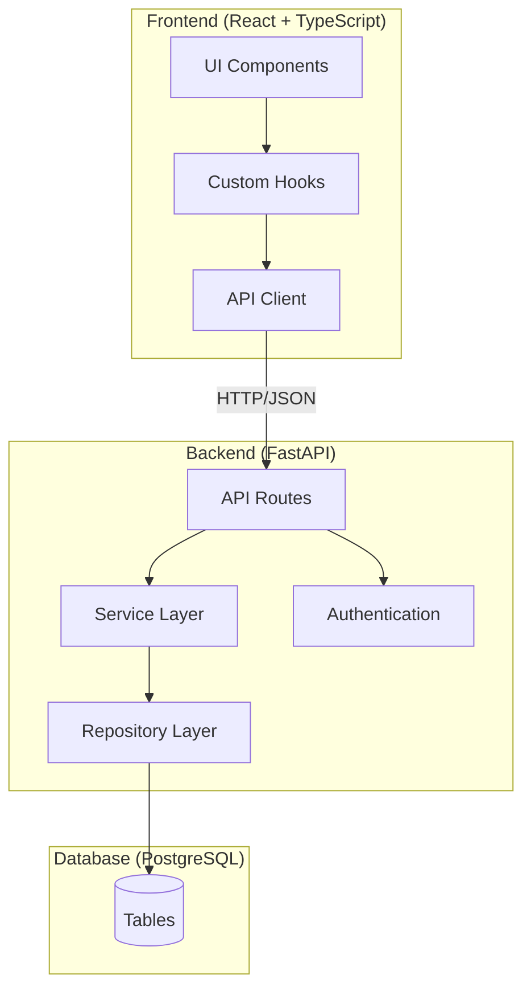
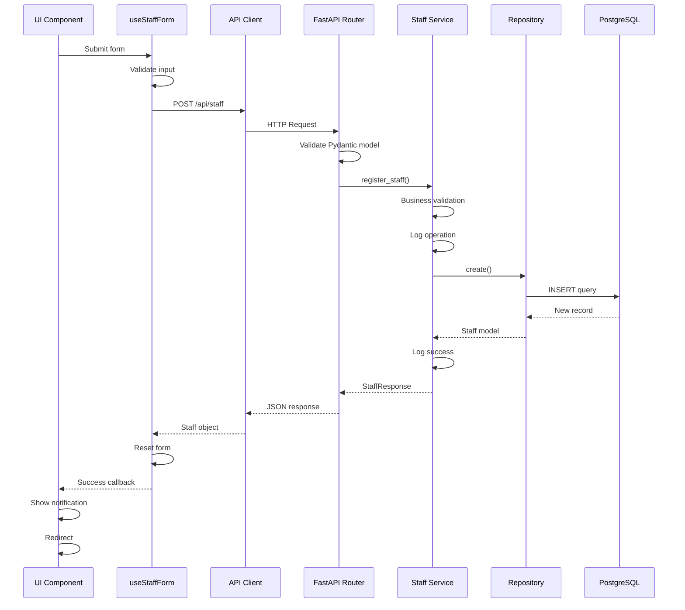
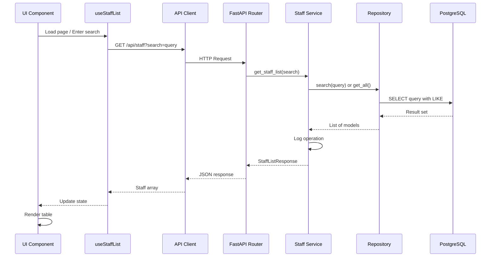

# Staff Management System - Design Document

## Overview

The Staff Management System is a comprehensive module for managing hospital administrative staff, including receptionists and hospital workers. The system follows enterprise architecture patterns with a clear separation between the React.js frontend, FastAPI backend, and PostgreSQL database. The design emphasizes type safety, maintainability, and scalability through the Service-Repository pattern on the backend and feature-based organization on the frontend.

### Key Design Principles

1. **Separation of Concerns**: Business logic (Service Layer) is separated from data access (Repository Layer) and API routing
2. **Type Safety**: Pydantic models on the backend mirror TypeScript interfaces on the frontend
3. **Dependency Injection**: FastAPI's dependency injection system provides loose coupling and testability
4. **Structured Logging**: All operations are logged in JSON format with PII masking
5. **Error Handling**: Structured error responses with user-friendly messages
6. **Responsive UI**: Mobile-first design with loading states and accessibility features

## Architecture

### System Architecture Diagram



### Layer Responsibilities

#### Frontend Layers

1. **UI Components**: Presentation components that render the interface
   - Form components for staff registration
   - Table components for staff lists
   - Modal components for edit operations

2. **Custom Hooks**: Business logic and state management
   - `useStaffList`: Manages fetching, filtering, and updating staff lists
   - `useStaffForm`: Handles form state and validation
   - `useApi`: Centralized API communication with error handling

3. **API Client**: HTTP communication layer
   - Centralized fetch wrapper with authentication
   - Type-safe request/response handling
   - Error transformation and retry logic

#### Backend Layers

1. **API Routes**: HTTP endpoint definitions
   - Request validation using Pydantic models
   - Response serialization
   - Dependency injection for services and authentication

2. **Service Layer**: Business logic and orchestration
   - Staff registration validation and processing
   - Search and filter logic
   - Transaction coordination

3. **Repository Layer**: Data access abstraction
   - CRUD operations for staff entities
   - Query building and execution
   - Database session management

4. **Authentication**: JWT-based authentication
   - Token validation
   - User authorization
   - Admin role verification

## Components and Interfaces

### Backend Components

#### Database Models

**Receptionist Model** (`models.Receptionist`)
```python
class Receptionist(Base):
    __tablename__ = "receptionists"
    
    id: int (Primary Key)
    first_name: str (Required)
    last_name: str (Required)
    phone: str (Required)
    created_at: datetime (Auto-generated)
    updated_at: datetime (Auto-updated)
```

**Worker Model** (`models.Worker`)
```python
class Worker(Base):
    __tablename__ = "workers"
    
    id: int (Primary Key)
    first_name: str (Required)
    last_name: str (Required)
    phone: str (Required)
    created_at: datetime (Auto-generated)
    updated_at: datetime (Auto-updated)
```

#### Pydantic Schemas

**Request Schemas**
```python
class StaffCreate(BaseModel):
    first_name: str
    last_name: str
    phone: str
    
    @validator('first_name', 'last_name', 'phone')
    def not_empty(cls, v):
        if not v or not v.strip():
            raise ValueError('Field cannot be empty')
        return v.strip()

class StaffUpdate(BaseModel):
    first_name: str | None = None
    last_name: str | None = None
    phone: str | None = None
```

**Response Schemas**
```python
class StaffResponse(BaseModel):
    id: int
    first_name: str
    last_name: str
    phone: str
    created_at: datetime
    updated_at: datetime
    
    class Config:
        from_attributes = True

class StaffListResponse(BaseModel):
    items: list[StaffResponse]
    total: int
```

#### Repository Layer

**Base Repository Interface**
```python
class BaseStaffRepository(ABC):
    @abstractmethod
    async def create(self, staff_data: StaffCreate) -> StaffModel
    
    @abstractmethod
    async def get_by_id(self, staff_id: int) -> StaffModel | None
    
    @abstractmethod
    async def get_all(self, skip: int = 0, limit: int = 100) -> list[StaffModel]
    
    @abstractmethod
    async def search(self, query: str) -> list[StaffModel]
    
    @abstractmethod
    async def update(self, staff_id: int, staff_data: StaffUpdate) -> StaffModel | None
    
    @abstractmethod
    async def delete(self, staff_id: int) -> bool
```

**Receptionist Repository** (`repositories.ReceptionistRepository`)
- Implements `BaseStaffRepository` for receptionist-specific operations
- Handles database queries with SQLAlchemy
- Manages database sessions via dependency injection

**Worker Repository** (`repositories.WorkerRepository`)
- Implements `BaseStaffRepository` for worker-specific operations
- Handles database queries with SQLAlchemy
- Manages database sessions via dependency injection

#### Service Layer

**Base Staff Service**
```python
class BaseStaffService(ABC):
    def __init__(self, repository: BaseStaffRepository, logger: Logger):
        self.repository = repository
        self.logger = logger
    
    async def register_staff(self, staff_data: StaffCreate) -> StaffResponse:
        # Validation logic
        # Logging
        # Call repository
        # Transform to response
    
    async def get_staff_list(self, search: str | None = None) -> StaffListResponse:
        # Search/filter logic
        # Logging
        # Call repository
        # Transform to response
    
    async def update_staff(self, staff_id: int, staff_data: StaffUpdate) -> StaffResponse:
        # Validation logic
        # Logging
        # Call repository
        # Transform to response
    
    async def delete_staff(self, staff_id: int) -> bool:
        # Logging
        # Call repository
```

**Receptionist Service** (`services.ReceptionistService`)
- Extends `BaseStaffService`
- Implements receptionist-specific business logic
- Handles validation and error transformation

**Worker Service** (`services.WorkerService`)
- Extends `BaseStaffService`
- Implements worker-specific business logic
- Handles validation and error transformation

#### API Routes

**Receptionist Routes** (`/api/receptionists`)
```python
POST   /api/receptionists          # Create receptionist
GET    /api/receptionists          # List all receptionists (with optional search)
GET    /api/receptionists/{id}     # Get receptionist by ID
PUT    /api/receptionists/{id}     # Update receptionist
DELETE /api/receptionists/{id}     # Delete receptionist
```

**Worker Routes** (`/api/workers`)
```python
POST   /api/workers                # Create worker
GET    /api/workers                # List all workers (with optional search)
GET    /api/workers/{id}           # Get worker by ID
PUT    /api/workers/{id}           # Update worker
DELETE /api/workers/{id}           # Delete worker
```

### Frontend Components

#### TypeScript Interfaces

```typescript
interface Staff {
  id: number;
  first_name: string;
  last_name: string;
  phone: string;
  created_at: string;
  updated_at: string;
}

interface StaffCreate {
  first_name: string;
  last_name: string;
  phone: string;
}

interface StaffUpdate {
  first_name?: string;
  last_name?: string;
  phone?: string;
}

interface StaffListResponse {
  items: Staff[];
  total: number;
}

interface ApiError {
  detail: string;
  status_code: number;
}
```

#### Feature Structure

```
frontend/src/features/staff/
├── components/
│   ├── StaffForm.tsx           # Reusable form component
│   ├── StaffTable.tsx          # Table with search/edit/delete
│   ├── StaffModal.tsx          # Modal for edit operations
│   └── LoadingSpinner.tsx      # Loading state component
├── hooks/
│   ├── useStaffList.ts         # List management logic
│   ├── useStaffForm.ts         # Form state and validation
│   └── useStaffApi.ts          # API communication
├── pages/
│   ├── ReceptionistList.tsx    # Receptionist list page
│   ├── AddReceptionist.tsx     # Add receptionist page
│   ├── WorkerList.tsx          # Worker list page
│   └── AddWorker.tsx           # Add worker page
├── types/
│   └── staff.types.ts          # TypeScript interfaces
└── api/
    └── staffApi.ts             # API client functions
```

#### Custom Hooks

**useStaffList Hook**
```typescript
interface UseStaffListReturn {
  staff: Staff[];
  loading: boolean;
  error: string | null;
  searchQuery: string;
  setSearchQuery: (query: string) => void;
  refreshList: () => Promise<void>;
  deleteStaff: (id: number) => Promise<void>;
  updateStaff: (id: number, data: StaffUpdate) => Promise<void>;
}

function useStaffList(staffType: 'receptionists' | 'workers'): UseStaffListReturn
```

**useStaffForm Hook**
```typescript
interface UseStaffFormReturn {
  formData: StaffCreate;
  errors: Record<string, string>;
  isSubmitting: boolean;
  handleChange: (field: string, value: string) => void;
  handleSubmit: () => Promise<void>;
  resetForm: () => void;
}

function useStaffForm(
  staffType: 'receptionists' | 'workers',
  onSuccess: () => void
): UseStaffFormReturn
```

## Data Models

### Database Schema

```sql
CREATE TABLE receptionists (
    id SERIAL PRIMARY KEY,
    first_name VARCHAR(100) NOT NULL,
    last_name VARCHAR(100) NOT NULL,
    phone VARCHAR(20) NOT NULL,
    created_at TIMESTAMP DEFAULT CURRENT_TIMESTAMP,
    updated_at TIMESTAMP DEFAULT CURRENT_TIMESTAMP
);

CREATE INDEX idx_receptionists_name ON receptionists(first_name, last_name);

CREATE TABLE workers (
    id SERIAL PRIMARY KEY,
    first_name VARCHAR(100) NOT NULL,
    last_name VARCHAR(100) NOT NULL,
    phone VARCHAR(20) NOT NULL,
    created_at TIMESTAMP DEFAULT CURRENT_TIMESTAMP,
    updated_at TIMESTAMP DEFAULT CURRENT_TIMESTAMP
);

CREATE INDEX idx_workers_name ON workers(first_name, last_name);
```

### Data Flow

#### Staff Registration Flow



#### Staff List with Search Flow




## Correctness Properties

*A property is a characteristic or behavior that should hold true across all valid executions of a system—essentially, a formal statement about what the system should do. Properties serve as the bridge between human-readable specifications and machine-verifiable correctness guarantees.*

### Core Data Properties

**Property 1: Staff registration round-trip consistency**
*For any* valid staff member (receptionist or worker) with first name, last name, and phone number, creating the staff member and then retrieving it from the database should return a record with all the same field values plus an automatically generated ID and timestamp.
**Validates: Requirements 2.4, 7.4, 11.1**

**Property 2: Staff update preserves unmodified fields**
*For any* existing staff member and any partial update containing a subset of fields, updating the staff member should modify only the specified fields while all other fields remain unchanged.
**Validates: Requirements 11.2**

**Property 3: Staff deletion completeness**
*For any* existing staff member, deleting the staff member should result in that staff member no longer being retrievable from the database by ID or appearing in any list queries.
**Validates: Requirements 5.5, 10.8, 11.3**

### Validation Properties

**Property 4: Empty field rejection**
*For any* staff registration or update request where any required field (first name, last name, or phone) is empty or contains only whitespace, the system should reject the request and not insert or modify any database record.
**Validates: Requirements 2.2, 2.5, 7.2, 7.5**

**Property 5: Input sanitization**
*For any* user input containing special characters or potential script injection attempts, the system should sanitize the input before processing and storage, preventing XSS or SQL injection attacks.
**Validates: Requirements 13.5**

**Property 6: Pydantic validation enforcement**
*For any* API request with a request body, the backend should validate the data against the corresponding Pydantic model and reject requests that don't conform to the schema before any business logic executes.
**Validates: Requirements 13.1**

**Property 7: Response schema compliance**
*For any* successful API response, the response data should conform to the defined Pydantic response model with all required fields present and correctly typed.
**Validates: Requirements 13.2**

### Search and Filter Properties

**Property 8: Search filter correctness**
*For any* search query string and any list of staff members, the filtered results should include only staff members whose first name or last name contains the search query (case-insensitive), and should include all such matching staff members.
**Validates: Requirements 5.2, 10.2**

**Property 9: Search reactivity**
*For any* search query entered in the UI, the displayed staff list should update to show filtered results without requiring a full page reload.
**Validates: Requirements 10.3**

### Success and Failure Handling Properties

**Property 10: Success notification on successful registration**
*For any* successful staff registration where the database insert succeeds, the system should display a success notification to the admin and redirect to the appropriate page.
**Validates: Requirements 3.1, 3.2, 8.1, 8.2**

**Property 11: Error notification on failed registration**
*For any* failed staff registration where validation fails or database insert fails, the system should display an error message to the admin and not display any success notification.
**Validates: Requirements 4.1, 4.3, 9.1, 9.3**

**Property 12: No partial data on failure**
*For any* staff registration or update operation that fails validation or encounters a database error, the system should not insert any partial or incomplete record into the database.
**Validates: Requirements 4.3, 9.3**

**Property 13: Newly registered staff appears in list**
*For any* successful staff registration, querying the staff list immediately after registration should include the newly registered staff member with all their details.
**Validates: Requirements 8.3**

### Timestamp Properties

**Property 14: Automatic timestamp generation**
*For any* successful staff registration, the created record should include a created_at timestamp that is within a few seconds of the current time when the registration was submitted.
**Validates: Requirements 2.3, 7.3**

### Logging Properties

**Property 15: Request logging**
*For any* API request received by the backend, the system should create a structured JSON log entry containing the request method, path, and timestamp.
**Validates: Requirements 14.1**

**Property 16: Error logging**
*For any* error that occurs during request processing, the system should create a structured JSON log entry containing the error type, message, and stack trace.
**Validates: Requirements 14.2**

**Property 17: Success operation logging**
*For any* successful staff registration, the system should create a structured JSON log entry containing the staff type (receptionist or worker), timestamp, and success status.
**Validates: Requirements 14.3**

**Property 18: PII masking in logs**
*For any* log entry that would contain personally identifiable information (phone numbers, full names), the system should mask or redact the sensitive data in the log output.
**Validates: Requirements 14.4**

**Property 19: No credential exposure in logs**
*For any* database error or connection failure, the system should log the error without including database credentials, connection strings, or other sensitive configuration in the log output.
**Validates: Requirements 14.5**

### Error Response Properties

**Property 20: Structured error responses**
*For any* error encountered during API request processing, the backend should return a JSON response containing an error message, HTTP status code, and error details in a consistent structure.
**Validates: Requirements 15.1**

**Property 21: No stack trace exposure**
*For any* error response returned to the frontend, the response should not include raw stack traces, internal file paths, or implementation details.
**Validates: Requirements 15.2**

**Property 22: User-friendly error messages**
*For any* error response received by the frontend, the system should display a user-friendly error message that explains the issue in non-technical terms.
**Validates: Requirements 15.3**

**Property 23: Field-specific validation errors**
*For any* validation error on a staff registration or update request, the error response should specify which field(s) failed validation and provide a reason for each failure.
**Validates: Requirements 15.4**

**Property 24: Network error handling**
*For any* network error or timeout when communicating with the backend, the frontend should display an appropriate error message and provide the user with retry options.
**Validates: Requirements 15.5**

### UI State Properties

**Property 25: Form validation state**
*For any* staff registration form, the submit button should be disabled when any required field is empty, and enabled when all required fields contain non-empty values.
**Validates: Requirements 1.2, 6.2**

**Property 26: Form submission prevention on invalid input**
*For any* attempt to submit a staff registration form with empty required fields, the system should prevent the form submission and display validation error messages.
**Validates: Requirements 1.3, 6.3**

**Property 27: Loading indicator display**
*For any* asynchronous operation that fetches data from the backend, the frontend should display a loading indicator (spinner or skeleton screen) while the operation is in progress.
**Validates: Requirements 16.2**

### Authentication and Authorization Properties

**Property 28: Unauthorized access rejection**
*For any* API request to staff management endpoints without a valid JWT token, the system should return an HTTP 401 Unauthorized error and not process the request.
**Validates: Requirements 17.1**

**Property 29: Non-admin access rejection**
*For any* API request to staff management endpoints from a user without admin role, the system should return an HTTP 403 Forbidden error and not process the request.
**Validates: Requirements 17.2**

**Property 30: JWT token inclusion**
*For any* API request from the frontend to staff management endpoints, the request should include the JWT token in the Authorization header.
**Validates: Requirements 17.5**

### Timestamp Properties

**Property 31: Updated timestamp on modification**
*For any* staff record update operation, the system should automatically set the updated_at field to the current timestamp while preserving the original created_at value.
**Validates: Requirements 18.3, 18.4**

### Not Found Error Properties

**Property 32: Not found error for non-existent staff**
*For any* attempt to retrieve, update, or delete a staff member using an ID that does not exist in the database, the system should return an HTTP 404 Not Found error with a descriptive message and not modify any database records.
**Validates: Requirements 19.1, 19.2, 19.3, 19.4**

**Property 33: User-friendly not found messages**
*For any* 404 Not Found error received by the frontend, the system should display a user-friendly message indicating the staff member was not found.
**Validates: Requirements 19.5**

### Database Error Handling Properties

**Property 34: Database error graceful handling**
*For any* database error (connection failure, transaction failure, timeout), the system should return an appropriate HTTP error response (500 for server errors, 400 for constraint violations) with a user-friendly message and log the full error details.
**Validates: Requirements 20.1, 20.2, 20.3, 20.4, 20.5**

**Property 35: Transaction rollback on failure**
*For any* database transaction that fails partway through, the system should roll back all changes made during that transaction, ensuring no partial data is committed to the database.
**Validates: Requirements 20.2**

## Error Handling

### Error Categories

1. **Validation Errors** (HTTP 400)
   - Empty or whitespace-only required fields
   - Invalid data format
   - Schema validation failures

2. **Not Found Errors** (HTTP 404)
   - Staff member ID does not exist
   - Endpoint not found

3. **Server Errors** (HTTP 500)
   - Database connection failures
   - Unexpected exceptions
   - Transaction failures

### Error Response Format

All error responses follow a consistent structure:

```json
{
  "detail": "User-friendly error message",
  "error_code": "VALIDATION_ERROR",
  "status_code": 400,
  "fields": {
    "first_name": "First name cannot be empty"
  }
}
```

### Frontend Error Handling Strategy

1. **Network Errors**: Display "Unable to connect to server" with retry button
2. **Validation Errors**: Display field-specific error messages inline
3. **Server Errors**: Display "Something went wrong" with support contact
4. **Timeout Errors**: Display "Request timed out" with retry button

### Backend Error Handling Strategy

1. **Catch all exceptions** at the router level
2. **Log errors** with full context (request ID, user, timestamp)
3. **Transform exceptions** to appropriate HTTP status codes
4. **Sanitize error messages** before sending to frontend
5. **Never expose** internal implementation details or stack traces

### Error Logging

All errors are logged with structured JSON format:

```json
{
  "timestamp": "2024-01-15T10:30:00Z",
  "level": "ERROR",
  "request_id": "abc123",
  "error_type": "ValidationError",
  "message": "Staff registration failed",
  "details": {
    "staff_type": "receptionist",
    "validation_errors": ["first_name: cannot be empty"]
  },
  "stack_trace": "..."
}
```

## Testing Strategy

### Unit Testing

#### Backend Unit Tests (Pytest)

**Repository Layer Tests**
- Test CRUD operations with mock database
- Test query building and filtering logic
- Test error handling for database failures
- Test transaction rollback on errors

**Service Layer Tests**
- Test business logic with mock repositories
- Test validation logic with various inputs
- Test error transformation
- Test logging calls

**Router Tests**
- Test request validation with Pydantic
- Test authentication and authorization
- Test response serialization
- Test error responses

#### Frontend Unit Tests (Vitest + React Testing Library)

**Component Tests**
- Test form rendering and field validation
- Test button enable/disable logic
- Test error message display
- Test loading state display

**Hook Tests**
- Test state management logic
- Test API call triggering
- Test error handling
- Test data transformation

**API Client Tests**
- Test request formatting
- Test response parsing
- Test error handling
- Test retry logic

### Property-Based Testing

Property-based testing will be implemented using:
- **Backend**: Hypothesis (Python)
- **Frontend**: fast-check (TypeScript)

Each property-based test should:
- Run a minimum of 100 iterations
- Generate random valid and invalid inputs
- Test edge cases automatically
- Include a comment referencing the design property

**Example Property Test Structure (Backend)**:
```python
from hypothesis import given, strategies as st
import pytest

# Feature: staff-management, Property 1: Staff registration round-trip consistency
@given(
    first_name=st.text(min_size=1, max_size=100).filter(lambda x: x.strip()),
    last_name=st.text(min_size=1, max_size=100).filter(lambda x: x.strip()),
    phone=st.text(min_size=1, max_size=20).filter(lambda x: x.strip())
)
def test_staff_registration_round_trip(first_name, last_name, phone):
    # Create staff member
    staff_data = StaffCreate(
        first_name=first_name,
        last_name=last_name,
        phone=phone
    )
    created_staff = service.register_staff(staff_data)
    
    # Retrieve staff member
    retrieved_staff = service.get_staff_by_id(created_staff.id)
    
    # Assert all fields match
    assert retrieved_staff.first_name == first_name
    assert retrieved_staff.last_name == last_name
    assert retrieved_staff.phone == phone
    assert retrieved_staff.id is not None
    assert retrieved_staff.created_at is not None
```

**Example Property Test Structure (Frontend)**:
```typescript
import fc from 'fast-check';
import { describe, it, expect } from 'vitest';

// Feature: staff-management, Property 8: Search filter correctness
describe('Staff search filtering', () => {
  it('should only return staff matching the search query', () => {
    fc.assert(
      fc.property(
        fc.array(staffArbitrary()),
        fc.string(),
        (staffList, searchQuery) => {
          const filtered = filterStaff(staffList, searchQuery);
          
          // All results should match the query
          filtered.forEach(staff => {
            const matchesFirstName = staff.first_name
              .toLowerCase()
              .includes(searchQuery.toLowerCase());
            const matchesLastName = staff.last_name
              .toLowerCase()
              .includes(searchQuery.toLowerCase());
            expect(matchesFirstName || matchesLastName).toBe(true);
          });
          
          // All matching staff should be included
          const allMatches = staffList.filter(staff =>
            staff.first_name.toLowerCase().includes(searchQuery.toLowerCase()) ||
            staff.last_name.toLowerCase().includes(searchQuery.toLowerCase())
          );
          expect(filtered.length).toBe(allMatches.length);
        }
      ),
      { numRuns: 100 }
    );
  });
});
```

### Integration Testing

**Backend Integration Tests**
- Test full request/response cycle with test database
- Test authentication flow
- Test database transactions
- Test error handling end-to-end

**Frontend Integration Tests**
- Test user flows (register → list → edit → delete)
- Test form submission with mock API
- Test navigation between pages
- Test error recovery flows

### Test Coverage Goals

- **Backend**: Minimum 80% code coverage
- **Frontend**: Minimum 70% code coverage
- **Property Tests**: All 27 correctness properties must have corresponding property-based tests
- **Critical Paths**: 100% coverage for registration and CRUD operations

### Testing Tools and Libraries

**Backend**:
- pytest: Test framework
- pytest-asyncio: Async test support
- hypothesis: Property-based testing
- pytest-cov: Coverage reporting
- factory-boy: Test data generation

**Frontend**:
- Vitest: Test framework
- React Testing Library: Component testing
- fast-check: Property-based testing
- MSW (Mock Service Worker): API mocking
- @testing-library/user-event: User interaction simulation

## Security Considerations

### Input Validation

1. **Whitelist Validation**: Only allow alphanumeric characters and common punctuation in names
2. **Length Limits**: Enforce maximum lengths for all string fields
3. **SQL Injection Prevention**: Use parameterized queries via SQLAlchemy ORM
4. **XSS Prevention**: Sanitize all user inputs before storage and display

### Authentication and Authorization

1. **JWT Tokens**: Use secure JWT tokens with appropriate expiration
2. **Admin Role Check**: Verify admin role before allowing staff management operations
3. **Token Validation**: Validate tokens on every protected endpoint
4. **Secure Headers**: Include security headers (CORS, CSP, etc.)

### Data Protection

1. **PII Handling**: Mask phone numbers in logs and error messages
2. **Secure Storage**: Store all data encrypted at rest in PostgreSQL
3. **Secure Transmission**: Use HTTPS for all API communication
4. **Audit Logging**: Log all staff management operations for audit trail

### Environment Security

1. **Environment Variables**: Store all secrets in environment variables
2. **No Hardcoded Secrets**: Never commit secrets to version control
3. **Database Credentials**: Use secure credential management
4. **API Keys**: Rotate API keys regularly

## Performance Considerations

### Database Optimization

1. **Indexes**: Create indexes on first_name and last_name for search performance
2. **Connection Pooling**: Use SQLAlchemy connection pooling
3. **Query Optimization**: Use efficient queries with proper filtering
4. **Pagination**: Implement pagination for large staff lists (future enhancement)

### Frontend Optimization

1. **Lazy Loading**: Load staff lists on demand
2. **Debounced Search**: Debounce search input to reduce API calls
3. **Caching**: Cache staff lists with appropriate invalidation
4. **Optimistic Updates**: Update UI optimistically before API confirmation

### API Performance

1. **Response Compression**: Enable gzip compression for API responses
2. **Minimal Payloads**: Return only necessary fields in responses
3. **Batch Operations**: Support batch operations for bulk updates (future enhancement)
4. **Rate Limiting**: Implement rate limiting to prevent abuse

## Deployment Considerations

### Database Migrations

1. Use Alembic for all schema changes
2. Test migrations on staging before production
3. Create rollback scripts for all migrations
4. Document migration dependencies

### Environment Configuration

**Development**:
- Local PostgreSQL database
- Debug logging enabled
- CORS allows localhost
- Hot reload enabled

**Staging**:
- Staging database with production-like data
- Info-level logging
- CORS restricted to staging domain
- Performance monitoring enabled

**Production**:
- Production PostgreSQL with backups
- Error-level logging only
- CORS restricted to production domain
- Full monitoring and alerting

### Monitoring and Observability

1. **Application Logs**: Structured JSON logs sent to centralized logging
2. **Error Tracking**: Integration with error tracking service (e.g., Sentry)
3. **Performance Metrics**: Track API response times and database query performance
4. **Health Checks**: Implement health check endpoints for monitoring

## Future Enhancements

1. **Pagination**: Add pagination support for large staff lists
2. **Advanced Search**: Support filtering by multiple criteria
3. **Bulk Operations**: Support bulk import/export of staff records
4. **Audit Trail**: Detailed audit log of all changes to staff records
5. **Role-Based Access**: More granular permissions for different admin roles
6. **Email Notifications**: Send notifications for staff registration events
7. **File Upload**: Support uploading staff photos or documents
8. **Advanced Validation**: Phone number format validation, duplicate detection
