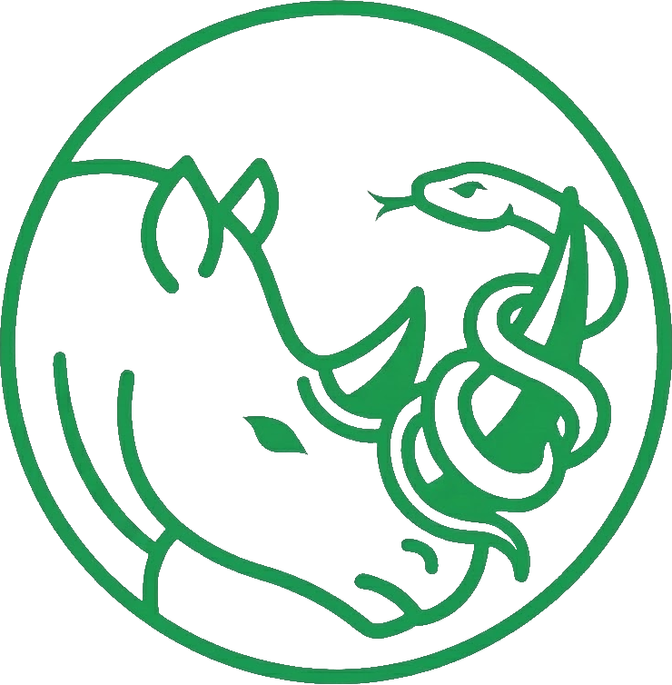

<div align="center">



# Hospital Management System: A Frankenstein Story

</div>

## 🎃 Try It Yourself!

**Live Demo:** [YouTube Link](https://youtu.be/NEFTtyJi_r8)

**Live Site:** [Frontend](https://rhino-hospital-kiroween.onrender.com/)

**Test Credentials:**

| Role | Username | Password |
|------|----------|----------|
| Doctor | `jekill` | `SendMails123@` |
| Nurse | `abby` | `SendMails123@` |
| Patient | `victor` | `SendMails123@` |

**Available Features:**
- 🏥 Hospital administration and staff management
- 📅 Appointment scheduling and calendar management
- 🩺 Patient blood pressure tracking and health reports
- 👥 Patient and doctor management
- 🔐 Role-based access control

---

## The Frankenstein Experiment: Bringing Dead Code Back to Life

Like Dr. Frankenstein assembling his creation from disparate parts, this project demonstrates something both thrilling and practical—the resurrection and fusion of legacy applications into a single, living system.

### The Challenge: Three Applications, Three Technologies, One Vision

In the dark corners of every organization lie abandoned applications—once vital, now obsolete. Different technologies, incompatible architectures, lost documentation. For this Kiroween experiment, we faced three such creatures:

**🏥 The Hospital Admin System** - https://github.com/highblix/hospitalmanagementvb6

**📅 The Appointment Manager** - https://github.com/erentnr/hospital-appointment

**🩺 The Blood Pressure Reporter** - https://github.com/juliemoore/PatientBloodPressureReport


### The Mad Science: Extracting Life from Dead Code

This is where the experiment begins. Using rhino.ai, we performed digital necromancy—extracting the living business logic from these dead applications:

**The Extraction Process:**
1. **Archaeological Discovery** - Fed the old codebases, documentation fragments, and user manuals into rhino.ai
2. **Logic Resurrection** - Rhino analyzed the disparate systems, identifying core business rules, data models, and workflows
3. **Unified Understanding** - Transformed three incompatible systems into three coherent business logic documents
4. **The Blueprint** - Created a specification for a new creature that combines the best parts of each

What emerged wasn't just documentation—it was the *essence* of each application, freed from the constraints of its original technology. In Rhino, we generated User Stories based on the required business logic for the applications. They are available within the KiroInput/RhinoDocs/ folder of the repository.

We then split the initial functionality into 3 scopes so that we could work on them in parallel. These are the .txt files in the KiroInput/ folder, alongside a technical prompt for creating steering documents and design specs.

### The Assembly: Building the Monster with Kiro

With the extracted business logic in hand, we turned to Kiro—our modern laboratory for bringing this Frankenstein creation to life. But this wasn't crude stitching and lightning bolts. This was *specification-driven reanimation*.

**The Creation Process:**

1. **The Specifications** - Transformed business logic into formal requirements and design documents. Each feature from the old applications was reimagined for the new system.

2. **The Architecture** - Designed a unified data model that could accommodate hospital administration, appointment scheduling, and patient monitoring in a single, coherent structure.

3. **The Implementation** - Used Kiro's task-based approach to systematically build each component, testing and verifying as we went.

4. **The Integration** - Wove together functionality from three separate applications into one living, breathing system.

The result? A modern application built on FastAPI, React, and PostgreSQL—but containing the business logic and workflows from three legacy systems.

### ⚡ The Timeline: 4 Days. Seriously.

Here's the shocking part: **this entire system was built in four working days (9-5, Monday through Thursday) by a team of three developers.**

Not "four days of sprinting around the clock." Not "four days plus nights and weekends." Four normal business days.

Traditional legacy migration projects take months or years. Rewriting from scratch? Even longer. But with rhino.ai extracting the business logic and Kiro orchestrating the implementation, we compressed what would normally be a multi-month project into less than a standard work week.

**Monday: Extraction & Specification**
- Morning: Fed legacy codebases into rhino.ai
- Afternoon: Reviewed extracted business logic, created unified specifications in Kiro
- End of day: Complete specs ready for implementation

**Tuesday-Wednesday: Implementation**
- Built backend models, services, and API endpoints
- Developed frontend components and workflows
- Integrated all three legacy system functionalities
- Continuous testing and verification throughout

**Thursday: Polish & Deploy**
- Final integration testing across modules
- UI/UX refinements
- Deployment preparation
- Production deployment complete

### 🤝 Team Collaboration: The Kiro Advantage

What made this speed possible wasn't just AI—it was how Kiro enabled seamless team collaboration:

**Shared Specifications as Source of Truth**
- All three developers worked from the same formal specifications
- No ambiguity about requirements or design decisions
- Changes to specs automatically visible to entire team

**Parallel Development Without Conflicts**
- Developer 1: Backend models and database layer
- Developer 2: API endpoints and business logic
- Developer 3: Frontend components and integration
- Kiro's task-based approach meant clear boundaries and minimal merge conflicts

**Continuous Verification**
- Each developer could verify their work independently
- Property-based tests ensured business logic preservation
- Integration tests caught cross-module issues early

**Living Documentation**
- Specifications stayed in sync with implementation
- New team members could onboard by reading specs
- Every feature traced back to original business logic

**Async Collaboration**
- Team members in different time zones
- Kiro provided context and continuity across sessions
- Commit messages referenced spec tasks for traceability

The traditional bottlenecks—meetings to clarify requirements, merge conflicts, integration issues, lost context—simply didn't happen. The specifications provided a shared mental model, and Kiro kept everyone aligned.

### It's Alive! The Unified System

What emerged from the laboratory isn't just a new application—it's a demonstration of what's possible when you can extract and recombine business logic across technological boundaries:

**From the Hospital Admin System:**
- Staff management (receptionists, workers, medical staff)
- Role-based access control
- Administrative workflows

**From the Appointment Manager:**
- Appointment scheduling and calendar management
- Doctor availability tracking
- Patient appointment history

**From the Blood Pressure Reporter:**
- Patient vital sign tracking
- Blood pressure monitoring
- Health report generation

All three systems, once isolated and incompatible, now work together seamlessly in a modern tech stack.

### The Lesson: Legacy Doesn't Mean Lost

This Frankenstein experiment proves something important: the business logic in your legacy applications isn't dead—it's just trapped. With the right tools:

- **rhino.ai extracts** the living logic from dead code
- **Kiro rebuilds** it in modern technologies  
- **Your team collaborates** efficiently with shared specifications
- **You deliver** in days, not months

No more "we can't migrate because we don't understand the old system." No more "the original developers are gone and the knowledge is lost." No more "this will take six months and half our budget."

The logic can be extracted, understood, and reborn—and your team can work together seamlessly to make it happen.

**What normally takes months:**
- ❌ 2-3 months: Reverse engineering legacy systems
- ❌ 1-2 months: Writing technical specifications
- ❌ 3-4 months: Implementation and integration
- ❌ 1-2 months: Testing and bug fixes
- ❌ **Total: 7-11 months (or more)**

**What we actually did:**
- ✅ Monday: rhino.ai extraction + Kiro specifications
- ✅ Tuesday-Wednesday: Implementation with continuous verification
- ✅ Thursday: Testing, polish, and deployment
- ✅ **Total: 4 business days**

That's not a typo. Four days of normal 9-5 work. No crunch time. No all-nighters. No pizza-fueled coding marathons. Just structured, specification-driven development with AI assistance.

### Technical Architecture

The reanimated creature runs on modern, production-ready technologies:

**Backend:**
- FastAPI (Python) - Modern, fast web framework with automatic API documentation
- PostgreSQL - Robust relational database with full ACID compliance
- SQLAlchemy - Powerful ORM with type safety and migration support
- Alembic - Database migration management
- JWT Authentication - Secure, stateless authentication
- Pydantic - Runtime type validation and serialization

**Frontend:**
- React - Component-based UI with hooks
- TypeScript - Type-safe JavaScript for better developer experience
- Modern CSS - Responsive design with CSS variables for theming
- Fetch API - Clean, promise-based HTTP client

**Infrastructure:**
- Docker & Docker Compose - Containerized deployment
- Automated migrations - Database schema versioning
- Environment-based configuration - Secure secrets management

## Services

- **PostgreSQL**: Database on port 5432 (mapped to 5433 on host)
- **FastAPI**: Backend API on port 8000
- **React**: Frontend on port 3000

## Quick Start

```bash
# Start all services (first time - will run migrations automatically)
docker-compose up -d

# View logs
docker-compose logs -f

# Stop all services
docker-compose down

# Reset database (WARNING: deletes all data)
docker-compose down -v
docker-compose up -d
```

## First Time Setup

1. **Start the services**:
   ```bash
   docker-compose up -d
   ```

2. **Create an admin user**:
   ```bash
   # Register via the frontend at http://localhost:3000
   # Or use the API:
   curl -X POST http://localhost:8000/api/register \
     -H "Content-Type: application/json" \
     -d '{
       "email": "admin@hospital.com",
       "username": "admin",
       "password": "admin123",
       "first_name": "Admin",
       "last_name": "User"
     }'
   
   # Set admin role
   docker-compose exec db psql -U postgres -d appdb -c \
     "UPDATE users SET role = 'admin' WHERE username = 'admin';"
   ```

3. **Access the application**:
   - Frontend: http://localhost:3000
   - Login with your admin credentials

## Access

- Frontend: http://localhost:3000
- Backend API: http://localhost:8000
- API Docs: http://localhost:8000/docs
- PostgreSQL: localhost:5432

## Database Credentials

- User: postgres
- Password: postgres
- Database: appdb

## Email Configuration (Optional)

Password reset emails are optional. To enable:

1. Copy `.env.example` to `.env`
2. Add your SMTP credentials:
```env
SMTP_USER=your-email@gmail.com
SMTP_PASSWORD=your-app-password
```
3. Restart backend: `docker compose restart backend`

See `EMAIL_SETUP.md` for detailed instructions.

**Without email configured**: Reset tokens will be logged to console instead.

## The Assembled Features

### 🏥 Hospital Administration (from the Admin System)
- Staff management for receptionists, workers, and medical personnel
- Role-based access control and permissions
- Administrative workflows and resource allocation
- Staff directory with search and filtering

### 📅 Appointment Management (from the Appointment Manager)
- Appointment scheduling with doctor availability
- Calendar views and time slot management
- Patient appointment history and tracking
- Automated conflict detection

### 🩺 Patient Health Monitoring (from the Blood Pressure Reporter)
- Blood pressure tracking and vital sign monitoring
- Health report generation and history
- Patient medical records and profiles
- Trend analysis and alerts

### 🔐 Unified Security (new integration layer)
- JWT-based authentication across all modules
- Role-based authorization (Admin, Doctor, Receptionist, Patient)
- Secure API endpoints with proper access control
- Password reset and account management

### 💻 Modern User Experience (rebuilt from scratch)
- Responsive design for desktop and mobile
- Real-time form validation and error handling
- Intuitive navigation across all three legacy systems
- Unified interface that makes the seams invisible

## The Reanimation Process

This project demonstrates a revolutionary approach to legacy modernization:

### 1. Extract Business Logic with rhino.ai
Instead of reverse-engineering code manually, rhino.ai analyzes legacy applications and extracts:
- Core business rules and validation logic
- Data models and relationships
- Workflow patterns and user journeys
- Integration requirements

### 2. Specify the New System with Kiro
Transform extracted logic into formal specifications:
- **Requirements** - Clear acceptance criteria for each feature
- **Design** - Modern architecture that unifies disparate systems
- **Tasks** - Granular implementation steps with verification
- **Properties** - Correctness guarantees that preserve business logic

### 3. Build and Verify Systematically
Kiro implements the specifications with continuous verification:
- Type checking and linting
- Unit and integration tests
- Property-based testing to ensure business rules hold
- Automated testing of cross-system integrations

### 4. Deploy the Unified System
The result is a single, modern application that combines functionality from multiple legacy systems—without losing any of the original business logic.

## Project Structure

```
hospital-management-system/
├── .kiro/                   # Kiro configuration and specs
│   ├── specs/              # Feature specifications
│   │   ├── patient-doctor-management/
│   │   ├── staff-management/
│   │   ├── auto-profile-creation/
│   │   ├── mailersend-integration/
│   │   ├── user-creation-improvements/
│   │   ├── user-table-restructuring/
│   │   └── vite-mui-migration/
│   └── steering/           # Development guidelines
│       ├── project-context.md
│       ├── coding-standards.md
│       ├── git-workflow.md
│       ├── database-guidelines.md
│       ├── database-migrations.md
│       ├── api-development.md
│       ├── docker-commands.md
│       └── testing-guide.md
├── backend/                # FastAPI backend
│   ├── alembic/           # Database migrations
│   ├── core/              # Core utilities and config
│   ├── middleware/        # Custom middleware
│   ├── repositories/      # Data access layer
│   ├── services/          # Business logic layer
│   ├── routers/           # API route handlers
│   ├── tests/             # Test suite
│   ├── models.py          # SQLAlchemy models
│   ├── schemas.py         # Pydantic schemas
│   ├── auth.py            # Authentication logic
│   ├── database.py        # Database connection
│   └── main.py            # Application entry point
├── frontend/              # React frontend with TypeScript
│   ├── src/
│   │   ├── components/    # Reusable UI components
│   │   ├── pages/         # Page components
│   │   ├── hooks/         # Custom React hooks
│   │   ├── types/         # TypeScript type definitions
│   │   └── App.tsx        # Main application component
│   ├── public/            # Static assets
│   └── vite.config.js     # Vite configuration
├── docs/                  # Documentation
│   ├── architecture/      # System design documents
│   │   ├── HIPAA_COMPLIANCE.md
│   │   ├── INTERNATIONAL_COMPLIANCE.md
│   │   ├── SESSION_MANAGEMENT.md
│   │   └── USER_ROLE_MANAGEMENT.md
│   ├── features/          # Feature documentation
│   │   ├── APPOINTMENTS.md
│   │   ├── BLOOD_PRESSURE_MONITORING.md
│   │   ├── HOSPITALIZATIONS.md
│   │   ├── MEDICAL_STAFF_MANAGEMENT.md
│   │   ├── PATIENTS.md
│   │   ├── PRESCRIPTIONS.md
│   │   ├── SHIFTS.md
│   │   └── PASSWORD_POLICY.md
│   └── setup/             # Setup and deployment guides
│       └── EMAIL_SETUP.md
├── KiroInput/             # Original stakeholder documents
│   ├── RhinoDocs/         # Rhino.ai generated user stories
│   │   ├── appointment-management-stories.pdf
│   │   ├── bloodpressure-report-stories.pdf
│   │   └── hospital-admin-stories.pdf
│   ├── Kiro-Technical-Prompt.txt
│   ├── Person1-Patient-Doctor-Management.txt
│   ├── Person2-Staff-Management.txt
│   └── Person3-Authentication-Access.txt
├── docker-compose.yml     # Container orchestration
└── README.md              # This file

```

## License

[MIT](https://choosealicense.com/licenses/mit/)

---

*Three legacy systems. Three developers. Four days. One living, breathing application.*

**Monday through Thursday. 9-5. No overtime. No crunch.**

**Built with rhino.ai extraction, Kiro collaboration, and a little mad science.** 🧪⚡
